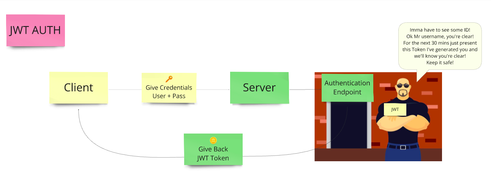
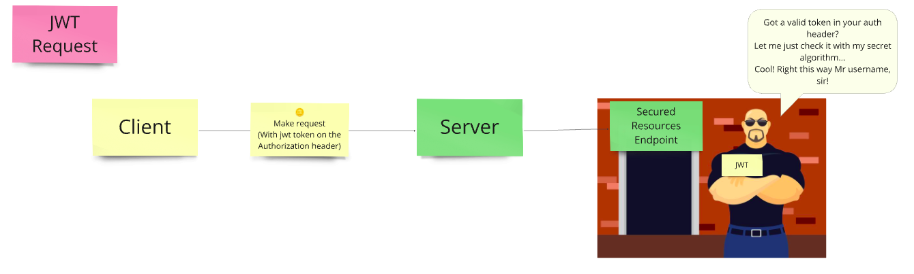
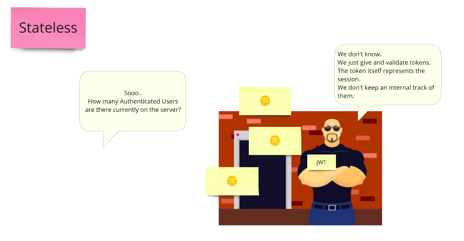
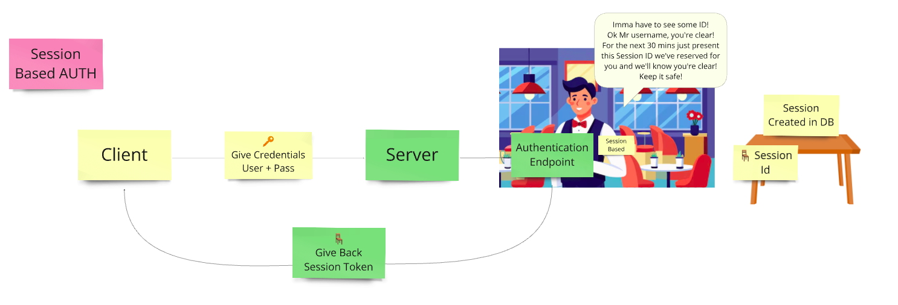
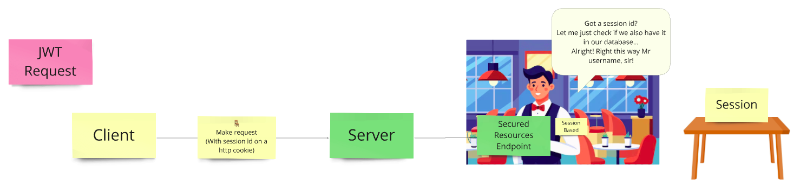
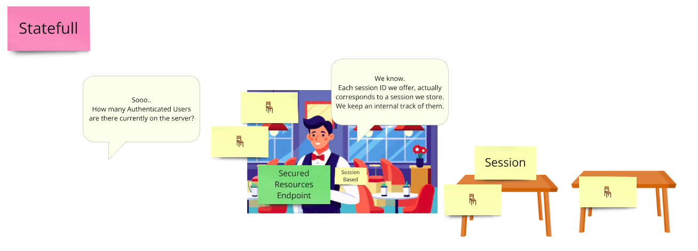
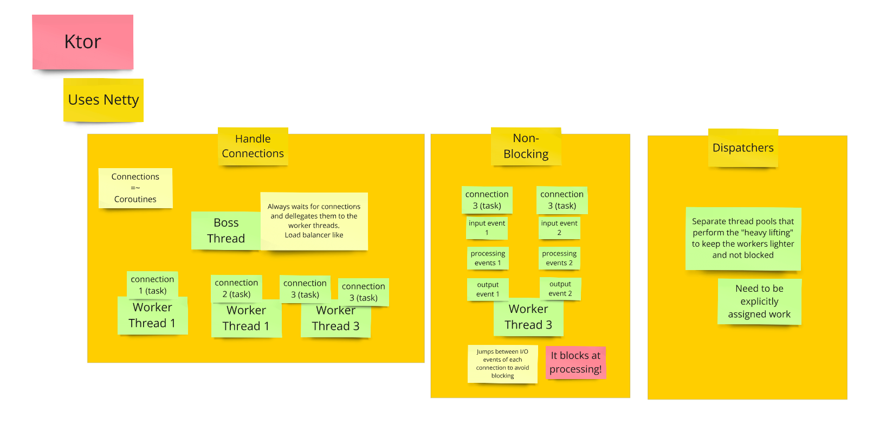

# Active Users Tracker

This project is a solution to track the number of authenticated users in real time.  
It consists of two components (each of them more thoroughly documented individually):

1. **[Server](./server-ktor/README.md) (Ktor-based backend)**
2. **[Client](./client-react/README.md) (React + Vite-based frontend)**

---

## Tech Stack
- **Backend**: Kotlin, Ktor, Sessions-based authentication, Gradle
- **Frontend**: React, Vite, Material-UI
- **Infrastructure**: Docker, Docker Compose

---

## Features
- **Real-time active user tracking** with SSE updates
- **Session-based authentication**
- **Responsive UI** with live updates
- **Environment-specific** configurations for both frontend and backend
- **Containerized** setup

---

## Local Setup

### Prerequisites
- Optional: Node.js (18+) and Gradle (7.6+) for local development.


### A. Run with Docker Compose
#### Prerequisites
- Docker and Docker Compose installed.

```bash
  docker compose up --build
```

- The server will run on: http://localhost:8080
- The client will run on: http://localhost:3000

Open the browser at http://localhost:3000


### B. Run locally
#### Prerequisites
- Node.js (18+) and Gradle (7.6+) installed

Start the server
```bash
  cd ./server-ktor && ./gradlew clean build && ./gradlew run
```

Start the client
```bash
  cd ./client-react && npm install && npm run dev
```

- The server will run on: http://localhost:8080
- The client will run on: http://localhost:5173

Open the browser at http://localhost:5173


---

# The Story Behind the Solution 🚀

## Introduction

This project became a much-needed cold shower in diving deeper into concepts I’ve avoided for far too long:
- user flows
- sessions
- real-time updates

Let’s explore together how I approached the challenge and the decisions that gave use this solution!


## The Problem Statement
**Objective**: Build a lightweight application that tracks and reports the number of active users in real-time

### Key Requirements:

- **Backend**: a JVM-based solution to track active users
- **Frontend**: dynamically displays the number of active users
- **Real-time Updates**: Ensure clients don’t make repeated requests to get user updates
- **Scalability**: Prepare for concurrency (requested) and horizontal scaling (always having this in mind)

## Active User: What Does It Mean?


The first challenge was defining *"active user"*.
This single term created so many multiple possibilities:

- Activity tracking: A user is active only while actively interacting with the page
- Websocket tracking: A user is active if authenticated and connected via Websocket
- Authentication tracking **(Chosen)**: A user is active if authenticated. This simplifies the problem, avoiding unnecessary complexity

By choosing Authentication tracking, I broke the problem into two manageable parts:

- **1. Authentication**: Identifying and managing active users
- **2. Real-Time Reporting**: Broadcasting the count of active users

## Exploring Authentication Approaches
Here came the crossroads: stateless or stateful?  
First I needed to understand both of them better.  
And, to be honest, I took advantage of this to prepare some course material for the students at the university:

### 1. Stateless Authentication: JWT 🏋️
   How it works: Users receive a self-contained token upon login. The server doesn’t store session data, relying solely on the token for authentication.
   Pro: No server-side session management => lightweight
   Con: Counting active users introduces a state, which defeats the purpose of JWT’s stateless nature. A shared storage mechanism is essential for scalability.
   Analogy I used for learning (and my design in MIRO): A club bouncer who checks IDs but doesn’t track who’s inside. “So…how many people are in the club?”








### 2. Stateful Authentication: Session-Based 🍽️
   How it works: The server manages sessions, storing them in memory or shared storage.
   Key Advantage: Tracking active users is implied by this method. Sessions are already stored, making it easier to determine active users.
   Analogy: A waiter managing a reservation list. “How many people are seated?” “I’ve got it right here, in the Database!”
   






Although session-based authentication seemed the obvious choice for this problem,
I started with JWT to embrace the challenge of making it stateful.
I will use both approaches in my examples at the university.

3 branches in this repo:
- dev-stateless: JWT approach for learning purposes
- dev-statefull: Session basses auth approach for interview purposes
- main: contains the statefull approach with session based auth


## Reporting Real-Time Updates

For real-time reporting, two primary methods came to mind:

1. WebSocket: A bidirectional communication channel
2. Server-Sent Events (SSE): A unidirectional communication channel for streaming updates

Given that the server only needs to push updates to the client, SSE was the clear winner - it’s lightweight and does the job

## Technology Stack: Why Kotlin and React?

The problem statement said to avoid Java and Spring Boot. So I took advantage to explore new technologies (which i <3 to do, I don't say it just for the interview, lol):

### Kotlin + Ktor
Kotlin’s wierd syntax and Ktor’s lightweight framework were the perfect combination for a JVM-based solution.
I took a *"Java as my model"* approach, leaning on ChatGPT to help me translate what I was mentally expressing in Java into Kotlyn.

### ReactJs
I chose React over Next.js (my usual choice for personal projects) to stay aligned with the lightweight requirement.
Reacts component-based structure was its main pro. But honestly, I think almost any modern framework/library would have did the trick.

### Docker:
To ensure the solution was portable and production-ready. Trust me. CICD is my poison, in a good way!
- Kotlyn boilerplate code had a solution with jib. I hated using jib out of my experience, i find it limitating, I created our own docker file
- I would have made a local, dev, stg, prod set of configs for both apps
- Make a github actions CICD for the frontend to be deployed in github pages (and tested with selenium in memory at deploy time)

But the weekend is too short for all these...

### Reactive Programming: The Data Stream Analogy 🌊

Implementing real-time updates naturally led me to reactive programming.   
I know it, I touched it, but never frequently used it.  
I visualized the user count as a continuous stream of data, with SSE acting as the tap delivering updates to clients.  
This approach aligned perfectly with the problem’s requirements and introduced me to the power of Kotlin’s Flow API.  
I digged a bit deeper into the "no blocking operations" idea. I went on to explore it all the way to the web server infrastructure (with a focus on netty):




